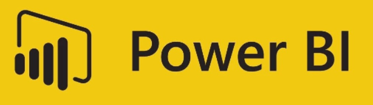

<div id="top"></div>

<!--[![Forks][forks-shield]][forks-url]-->
<!--[![Issues][issues-shield]][issues-url]-->


<!-- PROJECT Header -->
<br />
<div align="center">
    

  <h3 align="center">Fish Restocking Model - AB</h3>

  <p align="center">
    The model provides spatial and temporal analysis of the fish restocking programming by the Government of Alberta.
    <br />
    <a href="">View Demo</a>
    ·
    <a href="https://github.com/s-cheema/fish.restocking.ab/issues">Report Bug</a>
    ·
    <a href="https://github.com/s-cheema/fish.restocking.ab/issues">Request Feature</a>
  </p>
</div>


<!-- TABLE OF CONTENTS -->
<details>
  <summary>Table of Contents</summary>
  <ol>
    <li>
      <a href="#about-the-project">About The Project</a>
      <ul>
        <li><a href="#built-with">Built With</a></li>
      </ul>
    </li>
    <li>
      <a href="#getting-started">Getting Started</a>
      <ul>
        <li><a href="#prerequisites">Prerequisites</a></li>
        <li><a href="#installation">Installation</a></li>
      </ul>
    </li>
    <li><a href="#usage">Usage</a></li>
    <li><a href="#contact">Contact</a></li>
  </ol>
</details>


<!-- ABOUT THE PROJECT -->
## About The Project

[![Fish Restocking Model][product-screenshot]](https://example.com)

This data Model is based on the fish restocking data provided by the Government of Alberta. The model provides quantity of fish restock based by geo-location and time. Please use this model for in-depth analysis of the fish restocking in Alberta from 2009 to 2021.

<p align="right">(<a href="#top">back to top</a>)</p>


### Built With

This section should list any major frameworks/libraries used to bootstrap your project. Leave any add-ons/plugins for the acknowledgements section. Here are a few examples.

* [Microsoft Power BI](https://powerbi.microsoft.com/en-ca/what-is-power-bi/)
* [Microsoft Excel](https://www.microsoft.com/en-us/microsoft-365/excel)


<p align="right">(<a href="#top">back to top</a>)</p>


<!-- GETTING STARTED -->
## Getting Started

This is an example of how you may give instructions on setting up your project locally.
To get a local copy up and running follow these simple example steps.

### Prerequisites

This is an example of how to list things you need to use the software and how to install them.
* npm
  ```sh
  npm install npm@latest -g
  ```

### Installation

1. Get a free API Key at [https://example.com](https://example.com)
2. Clone the repo
   ```sh
   git clone https://github.com/your_username_/Project-Name.git
   ```
3. Install NPM packages
   ```sh
   npm install
   ```
4. Enter your API in `config.js`
   ```js
   const API_KEY = 'ENTER YOUR API';
   ```

<p align="right">(<a href="#top">back to top</a>)</p>


<!-- USAGE EXAMPLES -->
## Usage

Use this space to show useful examples of how a project can be used. Additional screenshots, code examples and demos work well in this space. You may also link to more resources.

_For more examples, please refer to the [Documentation](https://example.com)_

<p align="right">(<a href="#top">back to top</a>)</p>


<!-- CONTACT -->
## Contact

Website - [@Personal Website](https://cheema.dev/contact.html) - mail@cheema.dev

Model Link: [@fishrestockingModel](https://app.powerbi.com/view?r=eyJrIjoiN2Y2N2VmZjEtODE0YS00MTA2LWFmYTktMWYxMzlmMzQ4NmNiIiwidCI6IjVlMmZjYTQ0LWY5MmMtNGVkMC04NmI1LTY3MDgwMTkxNjZlMCJ9&pageName=ReportSection8106118b4d711c53265b)

<p align="right">(<a href="#top">back to top</a>)</p>


<!-- MARKDOWN LINKS & IMAGES -->
<!-- https://www.markdownguide.org/basic-syntax/#reference-style-links -->
[forks-url]: https://github.com/s-cheema/fish.restocking.ab/network/members
[issues-shield]: https://img.shields.io/github/issues/othneildrew/Best-README-Template.svg?style=for-the-badge
[issues-url]: https://github.com/s-cheema/fish.restocking.ab/issues
[product-screenshot]: images/fishmodelPowerBI.jpg
